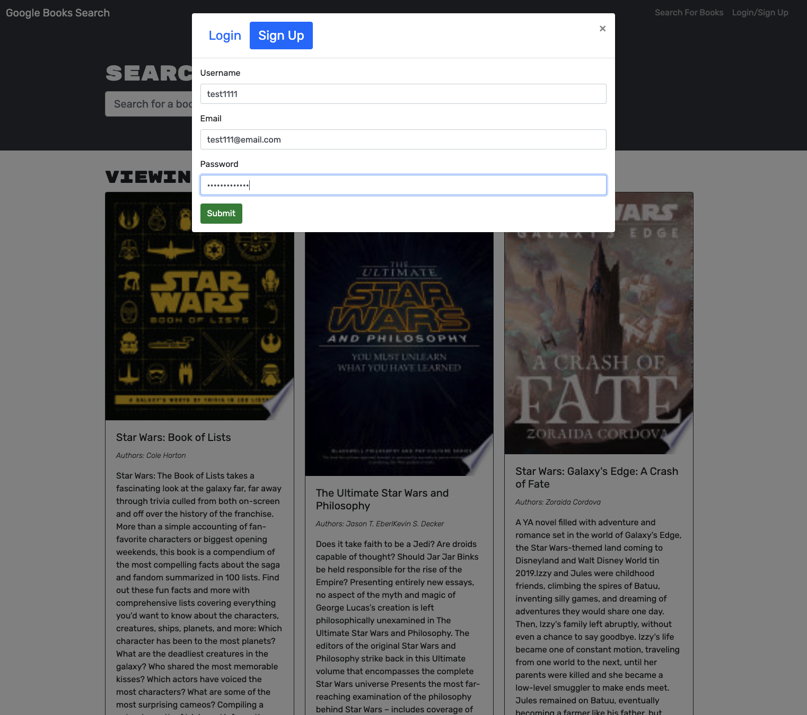
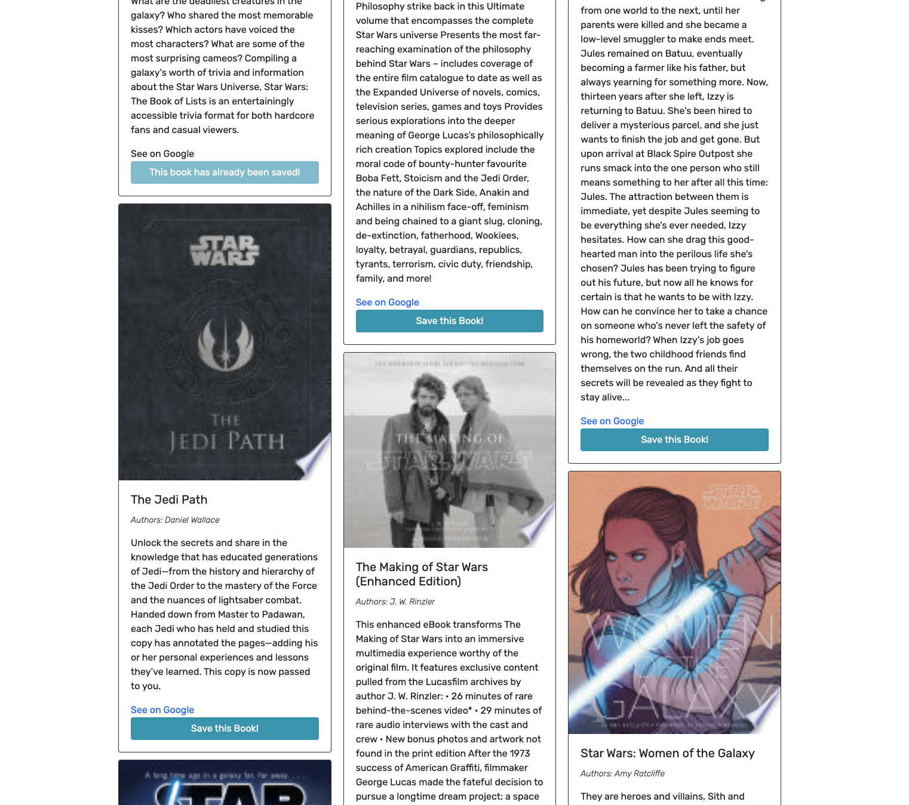

# Text Editor

<p> 
    
    
    
    
    
    
</p>


## Table of Contents
1. [Description](#description)
2. [User Story](#user-story)
3. [Screenshot](#screenshot)
4. [Heroku](#heroku)
5. [Installation](#installation)
6. [License](#license)
7. [Contributing](#contributing)
8. [Test](#test)
9. [Questions](#contact-information)

## Description
To build a Book Search Engine with GraphQL API built with Apollo Server. The app was built using the MERN stack, with a React front end, MongoDB database, and Node.js/Express.js server and API. It's already set up to allow users to save book searches to the back end.

## User Story
```md
AS AN avid reader
I WANT to search for new books to read
SO THAT I can keep a list of books to purchase
```

## Heroku
Please view the live application [here]()

## Screenshot





## Installation
To clone the repo:
```
git clone https://github.com/shelldan/text-editor.git
``` 
Run 'npm install' to install dependencies

Run 'npm start' to start the backend

Run 'npm run develop' to start both backend and frontend

---

## License
[](https://opensource.org/licenses/MIT) 

## Contributing 
To contribute to this application, create a pull request.
Here are the steps needed for doing that:
- Fork the repo
- Create a feature branch (git checkout -b NAME-HERE)
- Commit your new feature (git commit -m 'Add some feature')
- Push your branch (git push)
- Create a new Pull Request

Following a code review, your feature will be merged.

---

## Test:
There is no test available for this app. 

---

## Contact Information
* GitHub Username: [shelldan](https://github.com/shelldan)